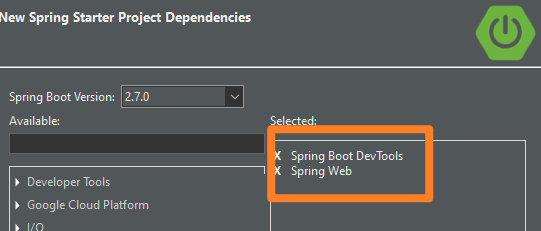
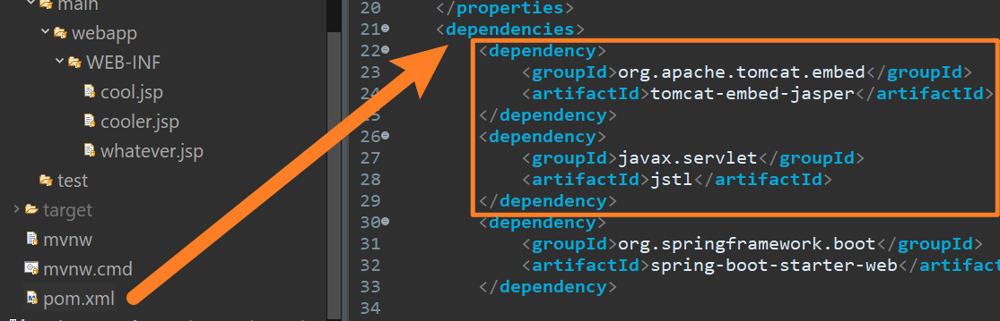
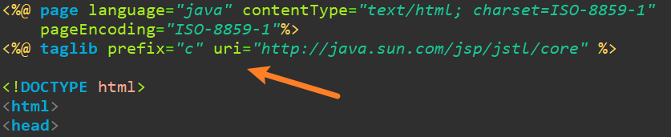

# End of week 1 JSP views and dependecies

### When starting our projects, so far we have added the default `spring starter project` dependencies.

- Spring Web
- DevTools


### for creating Views (JSP pages) we will need to add these depencencies in our `pom.xml`

```xml
<!-- tomcat server -->
 <dependency>
        <groupId>org.apache.tomcat.embed</groupId>
        <artifactId>tomcat-embed-jasper</artifactId>
</dependency>

<!-- JSTL tag library for use in our JSP pages -->
 <dependency>
        <groupId>javax.servlet</groupId>
        <artifactId>jstl</artifactId>
</dependency>
```



### and for every `jsp` page will need to inject JSTL in the page
**at the top of every `jsp page`** insert this line:
```
<%@ taglib prefix="c" uri="http://java.sun.com/jsp/jstl/core" %>
```



let's create some views! 
and don't forget the `@Controller` and the `Model model` for passing `${vars}` to our JSP page

💪😎